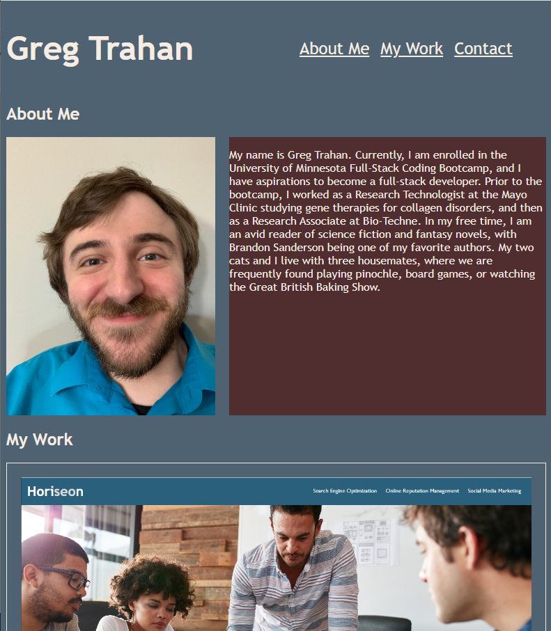

# 02 Advanced CSS: Portfolio

## Introduction

Name: Greg Trahan  
Due: 21DEC2022  

Click [here](https://greg-trahan.github.io/02-advanced-css/) to see my final project.

## Description
The goal of this assignment is to create a portfolio for myself, showcasing the projects I have done.

## Usage
This file can be given to potential employers to demonstrate the work I am capable of as a full-stack developer.

## What I did
I wrote an HTML portfolio and implemented CSS features such as FlexBox to create a visually appealing portfolio to show to future employers.

## What I learned
I learned some of what it takes to build a functional website, utilizing classes and ids to target specific elements with CSS styling and flexbox.
